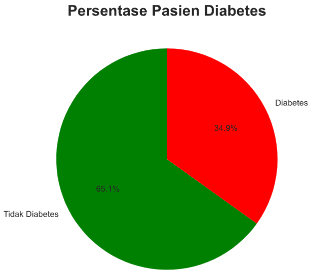
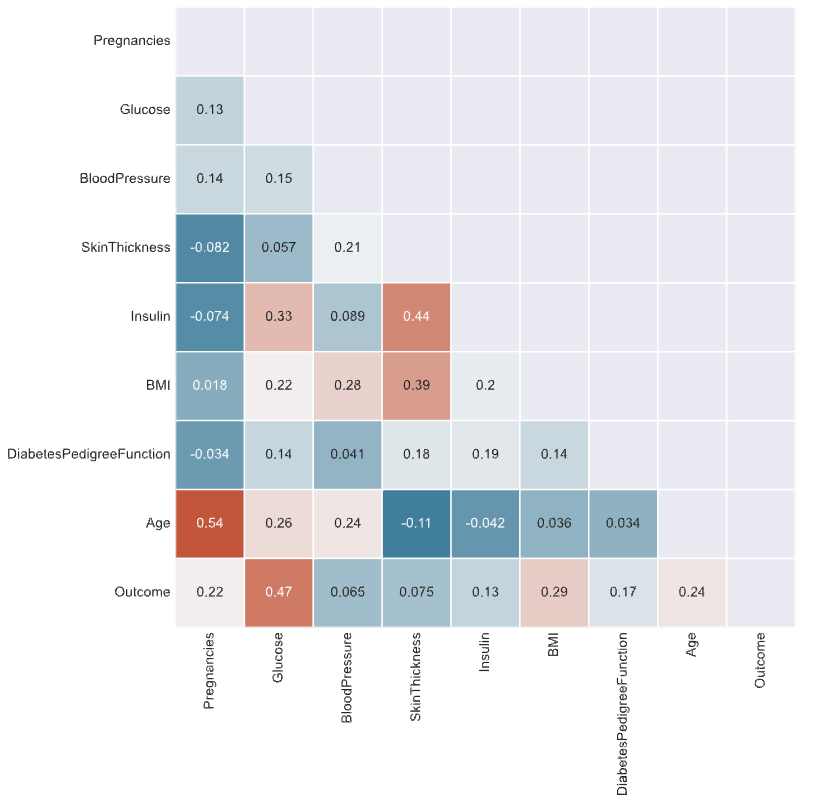
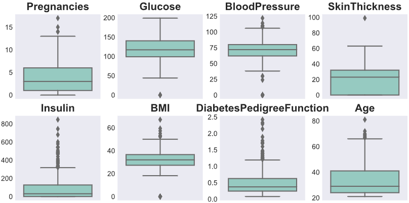
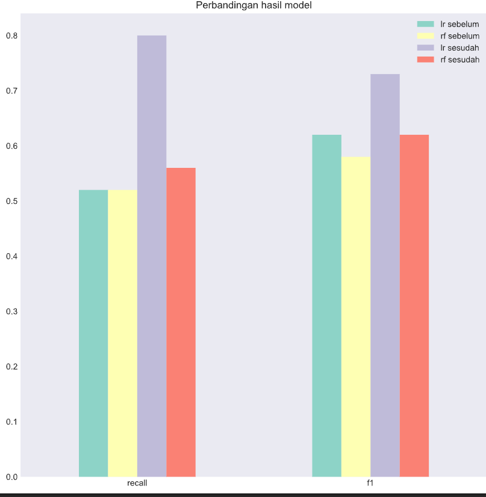
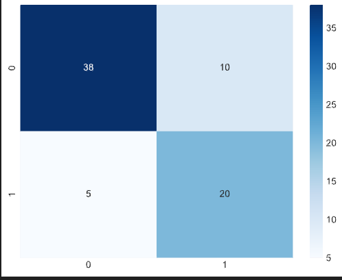
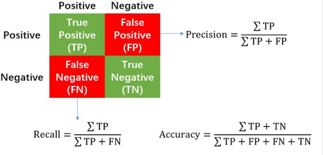

# Laporan Proyek Machine Learning - Alif Adwitiya Pratama

## Domain Proyek

Domain Proyek ini masuk kedalam topik kesehatan yaitu mengenai prediksi penyakit diabetes. Hal ini perlu dilakukan karena penyakit diabetes merupakan penyakit yang sangat berbahaya dan dapat menyebabkan kematian bahkan menurut penelitian [1]  menyumbang 11.3% kematian dunia diperkirakan menyumbang 1 dari 9 kematian pada orang dewasa umur 20-79. Oleh karena itu, perlu dilakukan prediksi penyakit diabetes agar dapat dilakukan pencegahan sejak dini. Penelitian yang sama pernah dibahas sebelumnya menghasilkan Logistic Regression (LR) classifier menghasilkan performansi paling baik dengan akurasi tertinggi 77.6%, recall 76% dan f1 score 75% [2]. Dalam proyek ini, akan dilakukan perbandingan performansi antara Logistic Regression (LR) dengan  Random Forest (RF). Kemudian akan dilakukan improvement terhadap model dengan _hyperparameter tuning_ untuk meningkatkan performansi model. 

## Business Understanding
### Problem Statements
- Apakah algoritma random forest dapat menghasilkan performansi yang lebih baik dibandingkan dengan logistic regression?
- apakah _hyperparameter tuning_ meningkatkan performansi model?
- Matriks performansi apa yang paling baik untuk mengukur performansi model?

### Goals
- Membandingkan performansi antara algoritma random forest dengan logistic regression
- Membandingkan performansi model sebelum dan sesudah di tuning
- Menentukan matriks performansi yang paling baik untuk mengukur performansi model

### Solution statements
- Menggunakan dua algoritma yaitu random forest dan logistic regression
- Menggunakan model grid search untuk _hyperparameter tuning_ dan default parameter
- Menjelaskan mengapa menggunakan matriks performansi yang dipilih

## Data Understanding
Dataset ini berasal dari National Institute of Diabetes and Digestive and Kidney Diseases. Tujuannya adalah untuk memprediksi berdasarkan pengukuran diagnostik apakah seorang pasien menderita diabetes. Batasan dataset ini adalah bahwa semua pasien adalah wanita berusia 21 tahun atau lebih dengan keturunan Pima Indian.
diambil dari [sini](https://www.kaggle.com/datasets/jillanisofttech/diabetes-disease-updated-dataset)

**Tentang Fitur**  
terdapat 8 fitur yang digunakan untuk memprediksi apakah seseorang menderita diabetes atau tidak. Fitur-fitur tersebut adalah:
- Pregnancies: Jumlah kehamilan
- Glucose: Konsentrasi glukosa plasma 2 jam dalam tes toleransi glukosa oral
- BloodPressure: Tekanan darah diastolik (mm Hg)
- SkinThickness: Ketebalan lipatan kulit trisep (mm)
- Insulin: Insulin serum 2 jam (mu U / ml)
- BMI: Indeks massa tubuh (berat dalam kg / (tinggi dalam m) ^ 2)
- DiabetesPedigreeFunction: Fungsi silsilah diabetes
- Age: Usia (tahun)

**Tentang Target** 
Target yang digunakan adalah Outcome, dimana 0 berarti tidak diabetes dan 1 berarti menderita diabetes.

**Tentang Dataset** 
Dataset ini memiliki 768 baris dan 9 kolom dengan 8 fitur dan 1 target. Terdapat 0 nilai null pada dataset dengan total dan 0 duplikat. Setelah dilakukan statistik deskriptiv didapatkan informasi bahwa

- **Usia:** Rata-rata usia pasien adalah 33 tahun, dengan rentang usia antara 21-81 tahun. Usia merupakan faktor risiko penting pada diabetes, di mana semakin tua usia seseorang, semakin besar kemungkinan untuk terkena diabetes.
- **Kehamilan:** Rata-rata jumlah kehamilan pada pasien adalah 4 kali (dibulatkan). Kehamilan yang berulang-ulang dapat meningkatkan risiko diabetes gestasional, yaitu diabetes yang terjadi selama kehamilan.
- **Glukosa darah:** Rata-rata kadar glukosa dalam darah pasien adalah 120,8 mg/dL. Glukosa darah yang tinggi dapat menunjukkan adanya diabetes atau kondisi yang disebut prediabetes, di mana kadar glukosa darah lebih tinggi dari normal namun belum cukup tinggi untuk dianggap sebagai diabetes.
- **Tekanan darah sistolik:** Rata-rata tekanan darah sistolik pada pasien adalah 69 mmHg. Tekanan darah yang tinggi dapat merusak pembuluh darah dan organ tubuh lainnya, dan dapat meningkatkan risiko diabetes.
- **Ketebalan kulit:** Rata-rata ketebalan kulit pada pasien adalah 20,5 mm. Ketebalan kulit yang rendah dapat menjadi faktor risiko diabetes tipe 2, di mana tubuh tidak dapat menggunakan insulin dengan efektif.
- **Insulin:** Rata-rata tingkat insulin pada pasien adalah 79,8 mu/L. Insulin yang tinggi dapat menunjukkan adanya resistensi insulin atau diabetes tipe 2.
- **Indeks massa tubuh (BMI):** Rata-rata indeks massa tubuh (BMI) pada pasien adalah 31,9 kg/m2. BMI yang tinggi dapat menjadi faktor risiko diabetes tipe 2.
- **DiabetesPedigreeFunction:** Rata-rata nilai fungsi DiabetesPedigreeFunction pada pasien adalah 0,47. Fungsi DiabetesPedigreeFunction menghitung risiko genetik seseorang terhadap diabetes tipe 2 berdasarkan riwayat keluarga.
- **Outcome:** Sekitar 34,8% dari pasien terdiagnosis mengidap diabetes. Hal ini menunjukkan bahwa kebanyakan pasien pada dataset ini tidak menderita diabetes.

Selain itu dilakukan visualisasi untuk melihat persentase pasien yang menderita diabetes dan tidak menderita diabetes. Hasilnya adalah 65.1% pasien tidak menderita diabetes dan 34.9% pasien menderita diabetes seperti yang terlihat pada gambar berikut  

kemudian dilakukan visualisasi untuk melihat korelasi antar fitur. Hasilnya didapatkan informasi bahwa tekanan darah dan ketebalan kulit tidak memiliki hubungan signifikan dengan diabetes sehingga dapat didrop dari dataset 

Terakhir dilakukan pengecekan outlier pada dataset. Hasilnya adalah terdapat outlier pada hampir tiap fitur seperti yang terlihat pada gambar berikut 

## Data Preparation
Pada tahap ini dilakukan proses data preparation yang meliputi:
- Drop kolom yang tidak digunakan yaitu kolom tekanan darah dan ketebalan kulit berdasarkan hasil analisis korelasi yang telah dilakukan sebelumnnya
- Drop outlier karena pada boxplot sebelumnya terlihat banyak outlier pada dataset. Drop outlier menggunakan metode isolasi forest karena metode ini dapat mendeteksi outlier berdasarkan kepadatan data. Sehingga tidak semua data yang keluar dari boxplot akan di drop, namun hanya yang memiliki kepadatan rendah.
- Split data menjadi data train dan data test dengan rasio 90 : 10 karena pada saat hyper parameter tuning menggunaka cross validation sehingga lebih baik jika data train lebih banyak.
- Scaling data menggunakan standard scaler karena data memiliki distribusi normal. Scaling hanya dilakukan pada data train agar tidak terjadi data leakage. Data test tidak di scaling karena data test adalah data yang seharusnya tidak diketahui oleh model.

## Modeling
model yang akan dibuat untuk memprediksi data adalah model logistic regression dan random forest. Model logistic regression digunakan karena telah dilakukan penelitian sebelumnya dan menghasilkan performansi yang terbaik pada penelitian tersebut. Selain itu akan digunakan model random forest dikarenakan menurut [3] Kelebihannya yaitu dapat mengatasi noise dan missing value serta dapat mengatasi data dalam jumlah yang besar. Dan kekurangan pada algoritma Random Forest yaitu interpretasi yang sulit dan membutuhkan tuning model yang tepat untuk data. Cara kerja logistic regression adalah dengan menghitung nilai maximum _likelihood_ yang menunjukan error model kemudian secara iteratif memperbaikinnya lebih lengkap dapat dilihat pada video [berikut](https://youtu.be/yIYKR4sgzI8?t=426). Sedangkan cara kerja random forest adalah dengan membuat banyak decision tree dan mengambil hasil voting dari semua decision tree tersebut lebih lengkap dapat dilihat pada video [berikut](https://www.youtube.com/watch?v=J4Wdy0Wc_xQ). Kemudian kedua model akan dituning dan akan dibandingkan performansi sebelum dan sesudah tuning, parameter tuning yang digunakan adalah sebagai berikut  
- Logistic Regression 
	- C : merupakan kebalikan dari regularisasi, semakin kecil nilai C maka semakin besar regularisasi yang digunakan. Regularisasi digunakan untuk menghindari overfitting. nilai C yang digunakan adalah 0.001, 0.01, 0.1, 1, 10, 100, 1000
	- penalty : tipe regularisasi yang digunakan. Penalty yang digunakan adalah 'l1', 'l2', 'elasticnet', dan 'none'
	- solver : algorithm yang digunakan untuk menghitung nilai maximum likelihood. Solver yang digunakan adalah 'newton-cg', 'lbfgs', 'liblinear', 'sag', dan 'saga'
	- max iter: jumlah maksimal iterasi. Banyak iterasi maksimal yang digunakan adalah 100, 500, dan 1000
- Random Forest 
	- n estimators : jumlah decision tree yang akan dibuat. Banyak decision tree yang digunakan adalah 10, 50, 100, 200, dan 500
	- max depth : kedalaman maksimal decision tree. Kedalaman maksimal yang digunakan adalah None, 10, dan 20
	- criterion : fungsi yang digunakan untuk menghitung impurity. Fungsi yang digunakan adalah 'gini' dan 'entropy'
	

## Evaluation
matriks evaluasi yang utama digunakan adalah recall karena recall adalah salah satu metrik yang digunakan untuk mengukur seberapa baik model mengatasi false negatif. Dimana false negatif pada kasus ini adalah pasien yang seharusnya terdiagnosis diabetes namun model memprediksi pasien tersebut tidak diabetes. Hal ini sangat berbahaya karena pasien tersebut tidak akan mendapatkan penanganan yang tepat. Selain itu juga digunaka f1 untuk mengamati precision dengan informasi recall. Pada kasus ini lebih baik tidak menggunakan recall karena data yang digunakan kurang seimbang sehingga mungkin menyebabkan bias. Hasil yang didapat adalah sebagai berikut  
 
dimana lr = LogisticRegression, rf = RandomForestClassifier, sebelum = sebelum tuning, sesudah = sesudah tuning 
dari hasil tersebut didapatkan bahwa model terbaik yang dihasilkan adalah logistic regression yang telah dituning dengan nilai recall sebesar 0.80 dan f1 score sebesar 0.73 dimana nilai recall dan f1 score tertinggi yang didapatkan pada penelitian sebelumnya adalah 0.76 dan 0.75 [2]. Hal ini menunjukkan bahwa model yang dihasilkan telah mengalami peningkatan performansi pada recall namun penurunan pada f1 score. Selain itu juga didapat informasi bahwa _hyperparameter tuning_ memiliki pengaruh untuk meningkatkan performansi model serta model random forest menghasilkan performansi yang lebih buruk dibandingkan dengan logistic regression. Hal ini menunjukkan bahwa model random forest tidak cocok untuk dataset ini. Perhitungan didapatkan melalui confusion matrix  berikut  

 
dimana row merupakan nilai aktual dan column merupakan nilai prediksi. nilai precision, recall, dan f1 score didapatkan melalui rumus berikut  

## Refrensi
[1]	[P. Saeedi et al., “Mortality attributable to diabetes in 20–79 years old adults, 2019 estimates: Results from the International Diabetes Federation Diabetes Atlas,” Diabetes Res Clin Pract, vol. 162, p. 108086, 2020.](https://pubmed.ncbi.nlm.nih.gov/32068099/)    
[2]	[A. Jakka and J. Vakula Rani, “Performance evaluation of machine learning models for diabetes prediction,” Int. J. Innov. Technol. Explor. Eng.(IJITEE), vol. 8, no. 11, 2019.](https://www.ijitee.org/wp-content/uploads/papers/v8i11/K21550981119.pdf)  
[3]	[S. R. Maziida, “Klasifikasi penyakit diabetes mellitus dengan menggunakan perbandingan algoritma J48 dan random forest (studi kasus : rumah sakit muhammadiyah lamongan),” 2018.](https://eprints.umm.ac.id/39299/3/BAB%202.pdf)  
 

