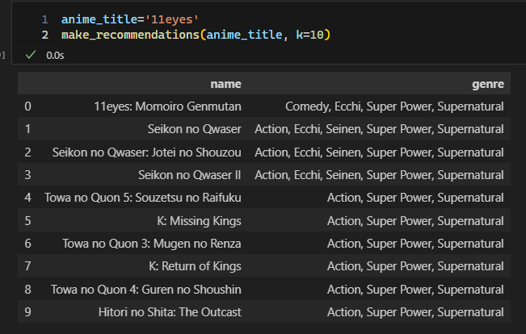
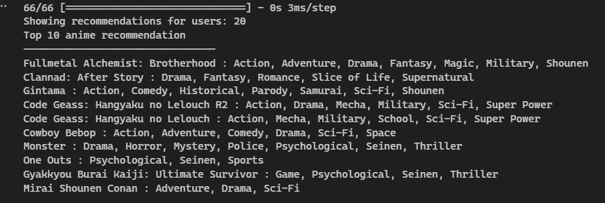
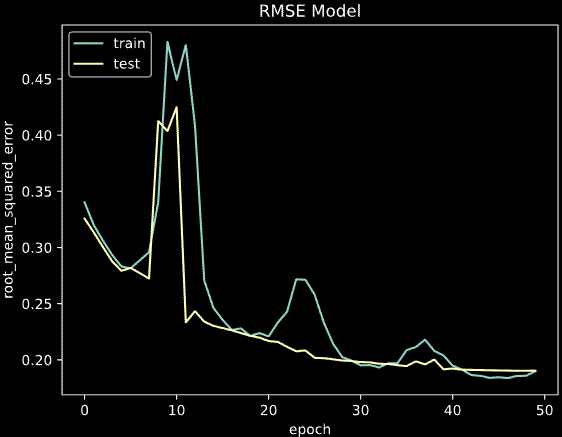

# Laporan Proyek Machine Learning - Alif Adwitiya Pratama

## Project Overview

menggantikan Amerika Serikat sebagai pengekspor komik dan animasi terbesar di dunia. Di Asia, komik dan animasi Jepang sangat populer dan berpengaruh sejak tahun 1980-an hingga sekarang. Saat ini, hampir semua negara Asia memiliki edisi komik Jepang mereka sendiri dan televisi mereka menayangkan serial animasi Jepang setiap hari. Berbagai bentuk budaya komik dan animasi Jepang, seperti kafe komik (manga kissha), penyewaan komik, dojinshi (manga amatir) dan cosplay (permainan kostum), telah merasuk ke dalam budaya konsumen di kota-kota besar di Asia [1]. Kepopuleran anime ini menginisiasi semakin banyak anime yang dirilis setiap tahunnya sehingga membuat pengguna merasa kesulitan dalam memilih anime yang sesuai dengan selera mereka. Karena maka dibutuhkanlah suatu sistem yang dapat merekomendasikan anime yang sesuai dengan selera pengguna.  Dengan adanya sistem ini, pengguna akan lebih mudah dalam menemukan anime yang sesuai dengan selera mereka. 


## Business Understanding

### Problem Statements

Menjelaskan pernyataan masalah:
- Bagaimana merekomendasikan anime yang sesuai dengan selera pengguna menggunakan metode Content Based ?
- Bagaimana merekomendasikan anime yang sesuai dengan selera pengguna menggunakan metode Colaborative ?
- Berdasarkan anime yang baru saja disukai pengguna, bagaimana cara membuat daftar rekomendasi anime ?

### Goals

Menjelaskan tujuan proyek yang menjawab pernyataan masalah:
- Membangun sistem rekomendasi menggunakan metode Content Based
- Membangun sistem rekomendasi menggunakan metode Colaborative
- Memberikan 10 rekomendasi anime berdasarkan input pengguna

### Solution statements
- Membangun sistem rekomendasi menggunakan metode Content Based berdasarkan genre menggunakan tfidf kemudian dilakukan perhitungan cosine similarity 
- Membangun sistem rekomendasi menggunakan metode Colaborative berdasarkan rating yang diberikan oleh pengguna menggunakan model tensorflow 
- untuk goals ketiga, hasil rekomendasi akan ditampilkan berdasarkan metode content based dan colaborative


## Data Understanding
dataset ini berisi tentang data rating anime yang diambil dari [myanimelist.net](https://myanimelist.net/). Dataset ini berisi informasi tentang data preferensi pengguna dari 7.813.737 (yang digunakan sebanyak 100.000) pengguna pada 12.294 anime yang berbeda yang dipisah kedalam dua dataset yaitu anime.csv yang berisi terkait informasi anime dan rating.csv yang berisi terkait rating user. Data ini diambil dari link kaggle [berikut.](https://www.kaggle.com/datasets/CooperUnion/anime-recommendations-database)

**Tentang Fitur** <br>

Dataset **anime.csv** ->  digunakan untuk content based filtering

- anime_id - id unik yang mengidentifikasi sebuah anime
- name - nama lengkap anime
- genre - daftar genre anime yang dipisahkan oleh koma
- type - tipe anime (film, TV, OVA, dll)
- episodes - jumlah episode dalam sebuah anime (1 jika film)
- rating - rata-rata rating dari 10 untuk anime tersebut
- members - jumlah anggota komunitas yang ada di grup anime tersebut

Dataset **Rating.csv** ->  digunakan untuk collaborative filtering

- user_id - id pengguna yang tidak dapat diidentifikasi secara acak
- anime_id - anime yang telah dinilai oleh pengguna tersebut
- rating - rating dari 10 yang diberikan oleh pengguna tersebut (-1 jika pengguna menonton anime tersebut tapi tidak memberikan rating)

dalam melakukan eksplorasi data dilakukan eksplorasi terpisah pada data anime dan rating, pada data anime dilakukan eksplorasi shape data didapatkan 12294 baris dan 7 kolom
dengan 4 kolom bertipe objek dan 3 kolom bertipe numerik. Tetapi terdapat kesalahan tipe data pada data episode yang disebabkan karena nilai null pada data ini bernilai "unknown" sehingga nilai ini perlu diganti dengan nilai nan. Setelah diperbaiki terdapat 3 kolom bertipe objek dan 4 kolom bertipe numerik. Selanjutnya dilakukan pencarian data null dan data duplikat pada data ini terdapat data null pada kolom genre, type, episodes, dan rating tetapi tidak ada data duplikat pada data ini. Terakhir dilakukan eksplorasi statistik deskriptif untuk menggambarkan data secara garis besar, didapatkan hasil sebagai berikut :
- Terdapat 2 judul anime yang sama tapi memiliki id berbeda (hal ini terjadi karena ada anime yang sama dengan tipe yang berbeda)
- Terdapat 12.292 judul anime yang unik
- Genre anime terdiri dari 3.264 jenis kombinasi genre berbeda
- Tipe anime terdiri dari 6 jenis yang berbeda
- Range jumlah episode anime sangat bervariasi, mulai dari 1  hingga 1818 episode dengan rata-rata 12 episode
- Rating rata-rata anime adalah 6,47 dari skala 1 hingga 10
- Jumlah rata-rata anggota komunitasi yang ada di grup anime adalah 1.807


pada data rating dilakukan eksplorasi data dengan teknik yang hampir sama. Dimulai dengan pengecekan shape data didapatkan 100.000 baris dan 3 kolom data dengan semua kolom memiliki tipe data numerik. Selanjutnya dilakukan pencarian data null menghasilkan tidak ada data null pada data ini. Pada data ini tidak dilakukan pencarian data duplikat karena data ini merupakan data rating yang memang seharusnnya memiliki data duplika. Terakhir dilakukan eksplorasi statistik deskriptif untuk menggambarkan data secara garis besar, didapatkan informasi bahwa rating yang diberikan oleh user rata-rata adalah 6.14 dari skala -1 hingga 10 dimana -1 pada dataset ini berarti user tersebut menonton anime tersebut tapi tidak memberikan rating nantinnya nilai -1 ini akan diubah jadi 0.


## Data Preparation
sama seperti data understanding, pada data preparation dilakukan dengan terpisah. Untuk model content based data preparation dimulai dengan mengambil fitur yang dibutuhkan dahulu yaitu anime_id, nama anime, dan genre. Fitur ini diambil karena akan dilakukan rekomendasi berdasarkan kesamaan genre antar anime. Kemudian karena terdapat data null pada kolom genre dilakukan penghapusan pada data null. Setelah data bersih, dilakukan ekstrasi fitur menggunakan teknik tfidf untuk menghitung bobot setiap genre pada setiap anime. 

Untuk model colaborative filtering data preparation dimulai dengan mengubah nilai rating -1 menjadi 0 agar tidak terjadi bias pada saat pemodelan. Kemudian dilakukan encoding pada kolom user_id dan anime_id agar lebih mudah dalam melakukan pemodelan. Setelah itu dilakukan normalisasi data dan split data menjadi data train dan data test dengan rasio 80:20.

## Modeling
pada model content based dilakukan pemodelan dengan membuat fungsi untuk melakukan rekomendasi berdasarkan nama anime yang diinputkan oleh user. Fungsi ini akan menghitung cosine similarity antara anime yang diinputkan dengan seluruh anime yang ada pada dataset berdasarkan ekstrasi fitur genre menggunakan tfidf yang telah dipersiapkan. Kemudian akan mengurutkan hasilnya dari yang paling mirip hingga yang paling tidak mirip. Setelah itu dilakukan rekomendasi dari salah satu anime sample user yaitu "11eyes". didapatkan hasil sebagai berikut<br>
<br>


pada model colaborative filtering dilakukan pemodelan dengan membuat model menggunakan tensorflow. Model ini memiliki 2 layer embedding, yaitu layer embedding untuk user dan layer embedding untuk anime. Setiap user dan anime direpresentasikan sebagai sebuah vektor dalam ruang embedding yang memiliki dimensi yang sama. Setiap elemen dalam vektor merepresentasikan tingkat kepentingan dari suatu fitur atau karakteristik tertentu. Vektor-vektor ini diperoleh melalui proses training pada saat model dilatih dengan data yang diberikan. Pada saat model dilatih, input yang diberikan berupa pasangan user-anime yang diberikan dalam bentuk indeks. Input ini akan diproses oleh model melalui layer embedding, kemudian akan dikomputasi hasil dot product antara embedding vektor user dan embedding vektor anime. Selanjutnya, hasil dot product ini akan dijumlahkan dengan user bias dan anime bias, yang juga diperoleh melalui layer embedding.
Akhirnya, hasil penjumlahan ini akan diproses melalui sebuah activation function sigmoid yang menghasilkan nilai antara 0 dan 1. Nilai ini merepresentasikan tingkat probabilitas bahwa pengguna tertentu akan menyukai anime tertentu. Kemudian model dicompile dengan loss binary cross entropy, optimizer adam dan metrics root mean square. Didapatkan hasil sebagai berikut<br>


## Kelebihan dan kekurangan model

### Collaborative Filtering
#### Kelebihan

- Tidak memerlukan informasi yang sangat detail mengenai item yang direkomendasikan.
- Dapat merekomendasikan item baru yang belum pernah dilihat oleh pengguna.
- Mampu merekomendasikan item yang tidak populer.

#### Kekurangan

- Rentan terhadap cold start problem, yaitu ketika pengguna baru atau item baru belum memiliki riwayat interaksi.
- Rentan terhadap user-item matrix yang sangat besar, sehingga memerlukan komputasi yang lebih tinggi.
- Rentan terhadap sparsity, yaitu ketika terdapat sedikit data interaksi antara pengguna dan item.

### Content-Based Filtering

#### Kelebihan

- Tidak rentan terhadap cold start problem, karena dapat merekomendasikan item berdasarkan informasi yang diberikan pada deskripsi item.
- Dapat merekomendasikan item yang lebih sesuai dengan preferensi pengguna.
- Dapat merekomendasikan item yang kurang populer.

#### Kekurangan

- Memerlukan informasi yang sangat detail mengenai item yang direkomendasikan.
- Tidak mampu merekomendasikan item baru yang belum pernah dilihat oleh pengguna.
- Rentan terhadap masalah overspecialization, yaitu ketika pengguna dianjurkan hanya untuk item yang mirip dengan item yang pernah disukai sebelumnya.


## Evaluation
Untuk evaluasi model content based berdasarkan diskusi [2] digunakan matriks performansi precision dengan rumus <br>
```
precision= rekomendasi relevan / item yang direkomendasikan
```
<br>
dimana rekomendasi relevan  adalah rekomendasi yang memiliki genre beririsan dengan histori anime yang pernah ditonton. Nilai precision ini didapatkan dengan membandingkan antara genre rekomendasi anime dengan genre anime yang pernah di tonton apabila rekomendasi tersebut memiliki genre yang sama maka rekomendasi tersebut dianggap relevan. Sedangkan item yang direkomendasikan adalah 10 rekomendasi anime yang diberikan. Sehingga nilai precision yang didapat pada model ini adalah 100%

untuk evaluasi model collaborative digunakan matriks performansi Root Mean Squared Error (RMSE) dengan rumus <br>
```
RMSE = sqrt(1/n * ∑(i=1)^n (yi - yhat)^2)
```
<br>
dimana yi adalah nilai asli dan yhat adalah nilai prediksi. Hasil prediksi dari model kolaboratif akan dihitung selisihnya dengan nilai real kemudian selisih tersebut akan dikuadratkan kemudian di akar 2 kan lagi sehingga nilai error pasti menjadi positif. Nilai RMSE pada model ini adalah 0.1900 untuk data train dan 0.1903 untuk data test didapatkan dari hasil akhir training model. Untuk lebih jelasnnya dapat melihat graf berikut




Refrensi:<br>
[1] https://www.cuhk.edu.hk/jas/staff/benng/publications/anime1.pdf <br><br>
[2] https://www.dicoding.com/academies/319/discussions/134402
